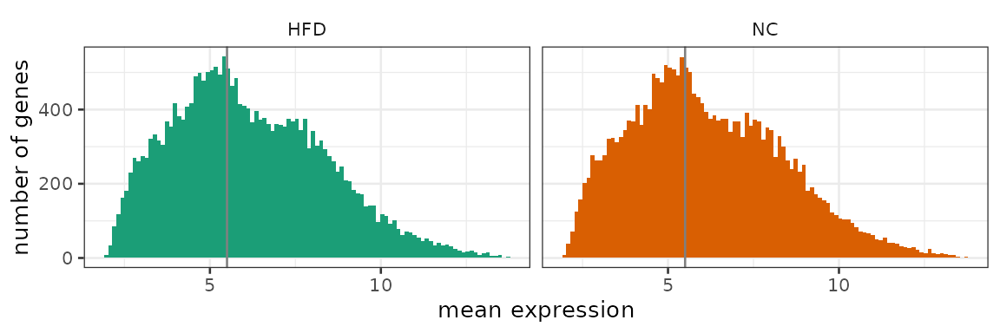
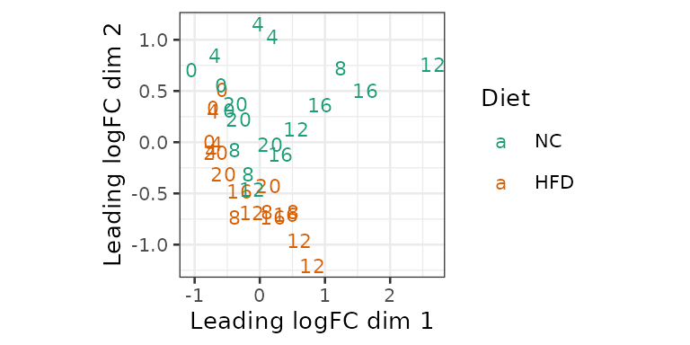

# Analyzing rhythmic data with compareRhythms

This package is designed to find features with altered circadian rhythm
parameters (*amplitude* and *phase*) between the control and
experimental groups. In this vignette, we will walk through two examples
that show the basic application of the `compareRhythms` package to
microarray and RNA-seq data. Nevertheless, any rhythmic data can be
analyzed using this package.

### Usage summary

The analysis is run using a single function
[`compareRhythms()`](https://bharathananth.github.io/compareRhythms/reference/compareRhythms.md).
To execute this function, the three necessary ingredients are the
timeseries data, the experimental design and parameters to choose and
tune the method. The output of the function is a *data.frame* with the
IDs of the differentially rhythmic features, the category they are
classified under and optionally the rhythm parameters of the features in
the two groups. The differential rhythmicity categories are **gain** of,
**loss** of, **change** of, or **same** rhythms (with respect to the
reference/control group).

### Time series data and experimental design

Only two inputs are mandatory to run the workflows in this package.

1.  A single (numeric) *matrix* combining both timeseries datasets. The
    rows of this matrix are the features and the columns are the
    different samples. The *rownames* of this data matrix provide the
    `id` list for the features.

2.  A *data.frame* specifying the experimental design (details regarding
    each sample) in order to interpret the data matrix.

    1.  There must be one row in this data.frame describing each sample
        (column) in the data matrix.
    2.  This data.frame must contain a numeric column named `time`
        specifying the time associated with the sample and a *factor*
        column named `group` specifying whether a sample belongs to the
        control or the experimental group. This `group` variable must
        have only two levels with one chosen as the reference with
        respect to which the results are presented.
    3.  Optionally, a column named `batch` can be used to specify a
        categorical (factor) covariate representing an independent or
        confounding variable (Note: covariates cannot be included in all
        methods. More on that below). Currently, there is no capability
        to include continuous covariates in the analysis.

### Choice of method

The package currently offers a choice of 6 different methods. We
describe below the tuning parameters available for each method.

There are three parameters that are common to all methods.

- `period` : This positive number is the period of the rhythms, whose
  amplitude and phase must be compared between the two timeseries
  datasets. Defaults to 24.

- `amp_cutoff` : Only features with a peak-to-trough amplitude greater
  than this positive number in at least one group are included in the
  differential rhythmicity results.

- `just_classify` : This boolean flag specifies if the amplitude and
  phase estimates of each differential rhythmic feature in the two
  groups (`just_classify = FALSE`) must be returned in addition to the
  list of `id`s and their classification into the differential
  rhythmicity categories.

There is one parameter available only to
`method = "limma"/"voom"/"deseq2"/"edger"`.

- `just_rhythms` : This boolean flag specifies if differential
  expression analysis should be performed alongside differential
  rhythmicity analysis (`just_rhythms = FALSE`). In other words, whether
  the magnitude of expression of features should also be compared across
  groups. Note, the statistical cutoff `rhythm_fdr` is also used for
  differential expression. This flag can be combined with
  `just_classify` to return fold change in expression and adjusted
  p-value for the comparison.

The different approaches can be divided into model selection and the
rest that are all implementations of hypothesis testing:

1.  - **Model selection** (`method = "mod_sel"` (default)):

      The different categories of differentially rhythmic features are
      represented by linear regression models that are fit to the data
      (Atger et al. 2015). The best model/category is selected by an
      information theoretic `criterion`. The quality of fit of the best
      category to the data is fine tuned using `schwarz_wt_cutoff`.

      - `criterion` is used to select the desired information criterion
        to pick the best model/category. “bic” (default) selects
        Bayesian Information Criterion (BIC) and “aic” selects Akaike
        Information Criterion (AIC). BIC penalizes model size more than
        AIC and hence favors smaller models.
      - `schwarz_wt_cutoff` (default = 0.6) is a probability threshold
        for the weight of the best model/category. The weight of the
        best model/category (called Schwarz weight with BIC and Akaike
        weight with AIC) is the probability that the chosen category is
        the best category given the data and the other
        models/categories. Higher this number (between 0 and 1), more
        certain is the classification. But models that do not reach this
        threshold are left unclassified.

    *Use cases*: This method can be used on any normalized data.
    Technically, the assumption that the noise/errors is/are normal at
    each sample and independent needs to be acceptable.

2.  - **DODR** (`method = "dodr"`):

      Rhythmic features in either group are first identified using
      [rain](https://doi.org/doi:10.18129/B9.bioc.rain) followed by
      filtering by rhythm amplitude (`amp_cutoff`). The resulting subset
      of features are processed using
      [DODR](https://cran.r-project.org/package=DODR) (Thaben and
      Westermark 2016), an R package to find the differentially rhythmic
      features. The features are classified after the fact into the 4
      categories listed above.

      - `rhythm_fdr` is the threshold for pre-filtering rhythmic
        features in either group based on the multiple testing corrected
        p-value from rain.
      - `compare_fdr` is the threshold for selecting differentially
        rhythmic features using the multiple testing corrected p-values
        from DODR.

    *Use cases*: This method can be used on any normalized data.

3.  - **limma** (`method = "limma"`):

      This is an implementation of **DODR** using the linear modeling
      approach for microarrays in
      [limma](https://doi.org/doi:10.18129/B9.bioc.limma) (Ritchie et
      al. 2015). The analysis follows the same steps with the difference
      that the filtering for rhythmic features in either group can be
      accomplished in a single test and differential rhythmicity test is
      also achieved in the same framework by comparing rhythm parameters
      (amplitude and phase).

      - `rhythm_fdr` is the threshold for pre-filtering rhythmic
        features in either group based on the multiple testing corrected
        p-value.
      - `compare_fdr` is the threshold for selecting differentially
        rhythmic features using the multiple testing corrected p-values
      - `robust` is a boolean to make the noise estimates for individual
        features in limma robust against outliers (see `eBayes` in
        [limma](https://doi.org/doi:10.18129/B9.bioc.limma) for
        details).

    *Use cases*: This method is to be used only on log normalized
    microarray data (see limma for details).

4.  - **voom** (`method = "voom"`):

      This is a variation of **limma** to also process RNA-seq data with
      the same pipeline. Count data are preprocessed using `voom` and
      then analyzed using the **limma** method above.

      - `rhythm_fdr` (see **limma**)
      - `compare_fdr` (see **limma**)
      - `robust` (see **limma**)
      - `outliers` is a boolean to downweight outlier *samples* in the
        analysis. (see `voomWithQualityWeights` in
        [limma](https://doi.org/doi:10.18129/B9.bioc.limma) for details)

    *Use cases*: This method is to be used with count data from an
    RNA-seq experiment. Count data from aligment (STAR, TopHat2)
    followed by quantification (htseq-count, summarizeOverlaps,
    featureCounts) can be directly used. If
    [tximport](https://doi.org/doi:10.18129/B9.bioc.tximport) is used to
    import data, then use counts after setting
    `countsFromAbundance = "lengthScaledTPM" or "scaledTPM"` in the
    `tximport()` call.

5.  - **DESeq2** (`method = "deseq2"`):

      This is the **limma** workflow adapted to process RNA-seq data
      according to [DESeq2](https://doi.org/10.18129/B9.bioc.DESeq2)
      (Love, Huber, and Anders 2014).

      - `rhythm_fdr` (see **limma**)
      - `compare_fdr` (see **limma**)
      - `length` is an optional *matrix* (with the same size as data)
        containing the average transcript length of each gene in each
        sample.

    *Use cases*: This method is to be used with count data from an
    RNA-seq experiment. Count data from aligment (STAR, TopHat2)
    followed by quantification (htseq-count, summarizeOverlaps,
    featureCounts) can be directly used. If
    [tximport](https://doi.org/doi:10.18129/B9.bioc.tximport) is used to
    import data, then use `counts` and `length` obtained from the
    `tximport()` call with `countsFromAbundance = "no"`.

6.  - **edgeR** (`method = "edger"`):

      This is the **limma** workflow adapted to process RNA-seq data
      according to [edgeR](https://doi.org/10.18129/B9.bioc.edgeR)
      (Robinson, McCarthy, and Smyth 2010).

      - `rhythm_fdr` (see **limma**)
      - `compare_fdr` (see **limma**)
      - `length` (see **DESeq2**)

    *Use cases*: This method is to be used with count data from an
    RNA-seq experiment. Count data from aligment (STAR, TopHat2)
    followed by quantification (htseq-count, summarizeOverlaps,
    featureCounts) can be directly used. If
    [tximport](https://doi.org/doi:10.18129/B9.bioc.tximport) is used to
    import data, then use `counts` and `length` obtained from the
    `tximport()` call with `countsFromAbundance = "no"`.

7.  **Cosinor** (`method = "cosinor"`): This implements the simple
    classical **cosinor** analysis and includes an option to deal with
    longitudinal data (which is common in data from human studies).

    - `rhythm_fdr` (see **limma**)
    - `compare_fdr` (see **limma**)
    - `longitudinal` is a boolean to switch between *independent* time
      samples (FALSE, default) or *repeated-measures* samples (TRUE).

    *Use cases*: This method can be used for any normalized dataset of
    moderate size (few hundreds of features). This analysis assumes that
    noise in the data is Gaussian and that there are no trends in the
    measurements across time. The `longitudinal = TRUE` requires the
    user to provide a factor column `ID` in the `exp_design` with the
    identity of each experimental unit that is repeatedly measured
    (Note: this analysis uses mixed-model framework of
    [lme4](https://cran.r-project.org/package=lme4)).

### Example 1: Microarray data

We analyze first the microarray data on the changes in circadian liver
transcriptome under high fat diet (HFD) with respect to normal chow (NC)
(Eckel-Mahan et al. 2013). This data is provided with this package as a
23060x36 matrix called `high_fat_diet_ma`. Liver transcripts were
quantified every 4h for 24h (6 samples) and the 2 different conditions
with 3 biological replicates each (36=6x2x3).
[maEndToEnd](https://bioconductor.org/packages/devel/workflows/vignettes/maEndToEnd/inst/doc/MA-Workflow.html)
describes how to perform quality control and normalization for
microarrays.

``` r
library(compareRhythms)
library(tidyverse)
```

``` r
head(high_fat_diet_ma[,1:6])
#>                     NC_ZT0_1  NC_ZT0_2  NC_ZT0_3 HFD_ZT0_1 HFD_ZT0_2 HFD_ZT0_3
#> ENSMUSG00000000001  9.404793  9.328668  9.310453  9.335252  9.470418  9.511085
#> ENSMUSG00000000003  2.470968  2.358439  2.502844  2.530175  2.453542  2.562028
#> ENSMUSG00000000028  6.017191  5.769798  5.707153  6.015197  5.702113  5.751801
#> ENSMUSG00000000031  5.317120  5.010673  5.068763  5.107669  5.193487  4.935580
#> ENSMUSG00000000037  3.672698  3.670284  3.971859  3.556922  3.798398  3.641636
#> ENSMUSG00000000049 12.677798 12.739597 12.590512 12.699638 12.782454 12.613611
colnames(high_fat_diet_ma)
#>  [1] "NC_ZT0_1"   "NC_ZT0_2"   "NC_ZT0_3"   "HFD_ZT0_1"  "HFD_ZT0_2" 
#>  [6] "HFD_ZT0_3"  "NC_ZT4_1"   "NC_ZT4_2"   "NC_ZT4_3"   "HFD_ZT4_1" 
#> [11] "HFD_ZT4_2"  "HFD_ZT4_3"  "NC_ZT8_1"   "NC_ZT8_2"   "NC_ZT8_3"  
#> [16] "HFD_ZT8_1"  "HFD_ZT8_2"  "HFD_ZT8_3"  "NC_ZT12_1"  "NC_ZT12_2" 
#> [21] "NC_ZT12_3"  "HFD_ZT12_1" "HFD_ZT12_2" "HFD_ZT12_3" "NC_ZT16_1" 
#> [26] "NC_ZT16_2"  "NC_ZT16_3"  "HFD_ZT16_1" "HFD_ZT16_2" "HFD_ZT16_3"
#> [31] "NC_ZT20_1"  "NC_ZT20_2"  "NC_ZT20_3"  "HFD_ZT20_1" "HFD_ZT20_2"
#> [36] "HFD_ZT20_3"
```

We will first construct the data.frame of the experimental design. In
this simple example, the required experimental design information is
encoded in the column names, which we extract.

``` r
exp_design <- str_split(colnames(high_fat_diet_ma), "_", simplify = TRUE)     # split the names by _
exp_design <- as.data.frame(exp_design, stringsAsFactors=TRUE)    # convert from matrix to data.frame
colnames(exp_design) <- c("group", "time", "rep")    # name the columns
exp_design$time <- as.numeric(sub("ZT", "", exp_design$time)) # remove ZT prefix and make numeric
head(exp_design)
#>   group time rep
#> 1    NC    0   1
#> 2    NC    0   2
#> 3    NC    0   3
#> 4   HFD    0   1
#> 5   HFD    0   2
#> 6   HFD    0   3
str(exp_design)   # view data type of each column
#> 'data.frame':    36 obs. of  3 variables:
#>  $ group: Factor w/ 2 levels "HFD","NC": 2 2 2 1 1 1 2 2 2 1 ...
#>  $ time : num  0 0 0 0 0 0 4 4 4 4 ...
#>  $ rep  : Factor w/ 3 levels "1","2","3": 1 2 3 1 2 3 1 2 3 1 ...
```

So `exp_design` has the two required columns *group* and *time*.
Furthermore, *group* is (as required) a factor with only 2 levels and
*time* is numeric. We can also check what the reference group is.

``` r
levels(exp_design$group) # the first level is the reference group
#> [1] "HFD" "NC"
exp_design$group <- relevel(exp_design$group, "NC") # choose NC as the correct reference group
```

It is also useful at this point to check whether there are any outlier
samples (columns) using PCA.

``` r
pca_ma <- prcomp(t(high_fat_diet_ma), scale. = FALSE)

varExp <- round(pca_ma$sdev^2/sum(pca_ma$sdev^2)*100, 1)

df <- data.frame(PC1 = pca_ma$x[,1], PC2 = pca_ma$x[,2],
                 diet = exp_design$group,
                 time = exp_design$time)

ggplot(df, aes(PC1, PC2)) + geom_text(aes(label=time, color=diet), size=3) +
  theme_bw(base_size=10) +   scale_color_brewer(name = "Diet", palette="Dark2") + 
  theme(aspect.ratio=1) + xlab(paste0("PC1, VarExp: ", varExp[1], "%")) +
  ylab(paste0("PC2, VarExp: ", varExp[2], "%"))
```

The first principal component (PC) seems to capture the time variation
and the second PC captures differences in diet. Therefore, the main
variations we are interested in are captured in top 2 PCs. There appear
to be no obvious outliers.

All `23060` genes (features) in the mouse transcriptome (according to
Ensembl) are included in the data. We want to keep only the strongly
enough expressed genes for differential rhythmicity analysis.

``` r
grp_ids <- levels(exp_design$group)   # extract the names of the two groups
mean_g1 <- rowMeans(high_fat_diet_ma[, exp_design$group == grp_ids[1]]) # mean expression of group 1
mean_g2 <- rowMeans(high_fat_diet_ma[, exp_design$group == grp_ids[2]]) # mean expression of group 2

df <- bind_rows(data.frame(mean=mean_g1, group=grp_ids[1]),
                data.frame(mean=mean_g2, group=grp_ids[2]))    # data.frame for plotting

ggplot(df) +
  stat_bin(aes(x=mean, fill=group), bins = 100) + facet_wrap(~group) + theme_bw(base_size=10) +
  geom_vline(xintercept = 5.5, color="grey50") + theme(strip.background = element_blank()) +
  xlab("mean expression") + guides(fill="none") + ylab("number of genes") +
  scale_fill_brewer(palette="Dark2")
```



``` r

keep <- (mean_g1 > 5.5) | (mean_g2 > 5.5)
table(keep)    # summary of how many genes will be kept after filtering
#> keep
#> FALSE  TRUE 
#>  9898 13162
expr_filtered <- high_fat_diet_ma[keep, ]
```

Before we run
[`compareRhythms()`](https://bharathananth.github.io/compareRhythms/reference/compareRhythms.md)
on this data let us check that \* the number of columns in
`expr_filtered` match number of rows of `exp_design`. \* `expr_filtered`
is a matrix and `exp_design` is a data.frame

``` r
nrow(exp_design) == ncol(expr_filtered)
#> [1] TRUE
class(exp_design)
#> [1] "data.frame"
class(expr_filtered)
#> [1] "matrix" "array"
```

We will analyze this microarray data using *model selection* first. Log2
normalized data such as `high_fat_diet_ma` can be directly used.

``` r
results <- compareRhythms(expr_filtered, exp_design = exp_design, 
                          period = 24, method = "mod_sel") # run with default parameters for schwarz_wt_cutoff and criterion
head(results)
#>                   id category
#> 1 ENSMUSG00000000001    arrhy
#> 2 ENSMUSG00000000028    arrhy
#> 3 ENSMUSG00000000049    arrhy
#> 4 ENSMUSG00000000056   change
#> 5 ENSMUSG00000000058    arrhy
#> 6 ENSMUSG00000000078    arrhy
table(results$category)    # number of genes in the different categories
#> 
#>  arrhy   loss   gain   same change 
#>   8911    137     27    501    158
```

For model selection alone, the number of arrhythmic features is
returned, since some features that have weights less than
`schwarz_wt_cutoff` are unclassified. Here, `13162` - `9734`= `3428`
genes are left unclassified.

If the peak-to-trough amplitude and peak phase (acrophase) estimates are
desired,

``` r
results <- compareRhythms(expr_filtered, exp_design = exp_design, period = 24, 
                          method = "mod_sel", just_classify = FALSE) # run with default parameters for schwarz_wt_cutoff and criterion
head(results)
#>                   id category   NC_amp NC_phase   HFD_amp HFD_phase   weights
#> 1 ENSMUSG00000000001    arrhy 0.000000 0.000000 0.0000000  0.000000 0.7949295
#> 2 ENSMUSG00000000028    arrhy 0.000000 0.000000 0.0000000  0.000000 0.7822633
#> 3 ENSMUSG00000000049    arrhy 0.000000 0.000000 0.0000000  0.000000 0.6327680
#> 4 ENSMUSG00000000056   change 1.097253 2.373042 0.7517809  2.180985 0.6574918
#> 5 ENSMUSG00000000058    arrhy 0.000000 0.000000 0.0000000  0.000000 0.8867482
#> 6 ENSMUSG00000000078    arrhy 0.000000 0.000000 0.0000000  0.000000 0.6069374
```

The amplitude is the units of the data (for this method) and phase is in
radians. To get the phase in h, multiply the phase estimates by
`period/(2*pi)`.

Next, we analyze the data using the *DODR* method. We only show entire
results (with `just_classify = FALSE`) for simplicity.

``` r
results <- compareRhythms(expr_filtered, exp_design = exp_design, period = 24, 
                          method = "dodr", just_classify = FALSE) # run with default parameters
head(results)
#>                   id category rhythmic_in_NC rhythmic_in_HFD diff_rhythmic
#> 1 ENSMUSG00000000056     same           TRUE            TRUE         FALSE
#> 2 ENSMUSG00000000555     same           TRUE            TRUE         FALSE
#> 3 ENSMUSG00000000567     same           TRUE            TRUE         FALSE
#> 4 ENSMUSG00000000708     same           TRUE           FALSE         FALSE
#> 5 ENSMUSG00000000876     same           TRUE            TRUE         FALSE
#> 6 ENSMUSG00000001018     same           TRUE           FALSE         FALSE
#>      NC_amp  NC_phase    HFD_amp HFD_phase adj_p_val_NC adj_p_val_HFD
#> 1 1.0972527 2.3730421 0.75178092  2.180985 1.088656e-05  9.814312e-06
#> 2 1.1161226 5.5799337 0.90190671  5.400475 2.045434e-05  2.755708e-05
#> 3 0.8647148 0.2533993 0.62547925  6.263871 4.117639e-04  1.503105e-03
#> 4 0.5127966 2.4419457 0.04522975  2.532181 2.210451e-03  9.421081e-01
#> 5 0.7570742 5.9485326 0.76704298  5.346225 3.682985e-05  8.200630e-05
#> 6 0.6343907 1.3344650 0.34417635  1.403223 2.285075e-03  3.077466e-03
#>   adj_p_val_DR
#> 1   0.27170004
#> 2   0.48350547
#> 3   0.48681880
#> 4   0.07669958
#> 5   0.05815103
#> 6   0.33171207
table(results$category)   # number of genes in the different categories
#> 
#> change   gain   loss   same 
#>     39      6     32   1157
```

In addition to the rhythm parameters (amplitude and phase), there are
boolean columns stating if the feature is rhythmic in NC and HFD and
whether the feature is also differentially rhythmic. These are derived
using tuning parameters `rhythm_fdr` and `compare_fdr` and the adjusted
p-values for the two rhythmicity tests using RAIN and differential
rhythmicity test from DODR.

Recall that the previous two approaches are not specific to microarray
data. Finally, we analyze this data using the linear modeling framework
of limma designed for microarray analysis.

``` r
results <- compareRhythms(expr_filtered, exp_design = exp_design, period = 24, 
                          method = "limma", just_classify = FALSE) # run with default parameters
head(results)
#>                   id category rhythmic_in_NC rhythmic_in_HFD diff_rhythmic
#> 1 ENSMUSG00000000056     same           TRUE            TRUE         FALSE
#> 2 ENSMUSG00000000303     same          FALSE            TRUE         FALSE
#> 3 ENSMUSG00000000555     same           TRUE            TRUE         FALSE
#> 4 ENSMUSG00000000567     same           TRUE            TRUE         FALSE
#> 5 ENSMUSG00000000708     same           TRUE           FALSE         FALSE
#> 6 ENSMUSG00000000876     same           TRUE            TRUE         FALSE
#>      NC_amp  NC_phase    HFD_amp  HFD_phase adj_p_val_NC_or_HFD adj_p_val_DR
#> 1 1.0972527 2.3730421 0.75178092 2.18098503        1.906244e-11   0.12104887
#> 2 0.4474557 5.8966561 0.85843846 0.02256061        2.131371e-02   0.47497910
#> 3 1.1161226 5.5799337 0.90190671 5.40047547        2.510419e-11   0.34303641
#> 4 0.8647148 0.2533993 0.62547925 6.26387110        1.970017e-05   0.47532705
#> 5 0.5127966 2.4419457 0.04522975 2.53218127        2.401673e-03   0.06055589
#> 6 0.7570742 5.9485326 0.76704298 5.34622495        1.126906e-09   0.05594469
table(results$category)   # number of genes in the different categories
#> 
#> change   gain   loss   same 
#>     46      9     33   1025
```

The returned columns are similar to that from *DODR* (as they are both
based on the same hypothesis testing approach). The only difference is
that the test for rhythmicity in either group can performed using a
single test, whose adjusted p-value is returned. The differential
rhythmicity test compares circadian parameters (as coefficients of a
harmonic regression) between the two groups. The boolean columns are
constructed (as before) using these p-values. Moreover, due to the
similarity of approaches, the results of the analyses are very similar.

We are often interested in comparing and contrasting features that are
differentially rhythmic with those that are differential expressed
across the two groups. The results for differential expression can be
returned additionally by
[`compareRhythms()`](https://bharathananth.github.io/compareRhythms/reference/compareRhythms.md)
by setting the `just_rhythms = FALSE` (by default set to `TRUE`). The
classification of features by expression is provided in column
`category_DE`. If `just_classify = FALSE` is also set, then the changes
in expression between groups and their adjusted p-values are also
included in the returned results. Note, a feature is classified as `NA`
if either it is not differentially expressed or was not considered
rhythmic in either group.

``` r
results <- compareRhythms(expr_filtered, exp_design = exp_design, period = 24, 
                          method = "limma", just_rhythms = FALSE) # run with default parameters
head(results)
#>                   id category rhythmic_in_NC rhythmic_in_HFD diff_rhythmic
#> 1 ENSMUSG00000000049     <NA>             NA              NA            NA
#> 2 ENSMUSG00000000056     same           TRUE            TRUE         FALSE
#> 3 ENSMUSG00000000085     <NA>             NA              NA            NA
#> 4 ENSMUSG00000000134     <NA>             NA              NA            NA
#> 5 ENSMUSG00000000149     <NA>             NA              NA            NA
#> 6 ENSMUSG00000000154     <NA>             NA              NA            NA
#>   category_DE
#> 1      up-reg
#> 2        <NA>
#> 3    down-reg
#> 4    down-reg
#> 5      up-reg
#> 6    down-reg
```

With these results, we can also compare features that are differentially
rhythmic to those that are differentially expressed. Although a core set
of genes are differentially rhythmic and differentially expressed, many
more genes are altered only in their expression or rhythmicity.

``` r
xtabs(~category + category_DE, data=results, addNA = TRUE)   # number of genes in the different categories
#>         category_DE
#> category down-reg up-reg <NA>
#>   change        8     16   22
#>   gain          3      1    5
#>   loss          4      8   21
#>   same        177    188  660
#>   <NA>       1222    896    0
```

We can also vary the parameters `amp_cutoff`, `compare_fdr` and
`rhythm_fdr` as necessary.

``` r
results <- compareRhythms(expr_filtered, exp_design = exp_design, period = 24, 
                          method = "limma", just_classify = TRUE, amp_cutoff = 0.1)
table(results$category)
#> 
#> change   gain   loss   same 
#>     62      1      1   3118
results <- compareRhythms(expr_filtered, exp_design = exp_design, period = 24, 
                          method = "limma", just_classify = TRUE, rhythm_fdr = 0.1)
table(results$category)
#> 
#> change   gain   loss   same 
#>     41      8     30   1122
results <- compareRhythms(expr_filtered, exp_design = exp_design, period = 24, 
                          method = "limma", just_classify = TRUE, compare_fdr = 0.1)
table(results$category)
#> 
#> change   gain   loss   same 
#>     97     19     80    917
```

### Example 2: RNA-seq data

We next analyze an RNA-sequencing dataset comparing the effect of a high
fat diet on the mouse liver transcriptome with the same experimental
design (Quagliarini et al. 2019). This data too is provided with this
package as a 37310x36 matrix called `high_fat_diet_rnaseq`. We follow a
similar sequence of steps as for microarrays in Example 1.

``` r
library(compareRhythms)
library(edgeR)
library(tidyverse)
library(DESeq2)
```

``` r
head(high_fat_diet_rnaseq[, 1:6])
#>                      HFD_ZT0_1 HFD_ZT0_2 HFD_ZT0_3 HFD_ZT4_1 HFD_ZT4_2
#> ENSMUSG00000090025.1         0         0         0         0         0
#> ENSMUSG00000064842.1         0         0         0         0         0
#> ENSMUSG00000051951.5         0         0         0         0         0
#> ENSMUSG00000089699.1         0         0         0         0         0
#> ENSMUSG00000088390.1         0         0         0         0         0
#> ENSMUSG00000089420.1         0         0         0         0         0
#>                      HFD_ZT4_3
#> ENSMUSG00000090025.1         0
#> ENSMUSG00000064842.1         0
#> ENSMUSG00000051951.5         2
#> ENSMUSG00000089699.1         0
#> ENSMUSG00000088390.1         0
#> ENSMUSG00000089420.1         0

colnames(high_fat_diet_rnaseq)
#>  [1] "HFD_ZT0_1"  "HFD_ZT0_2"  "HFD_ZT0_3"  "HFD_ZT4_1"  "HFD_ZT4_2" 
#>  [6] "HFD_ZT4_3"  "HFD_ZT8_1"  "HFD_ZT8_2"  "HFD_ZT8_3"  "HFD_ZT12_1"
#> [11] "HFD_ZT12_2" "HFD_ZT12_3" "HFD_ZT16_1" "HFD_ZT16_2" "HFD_ZT16_3"
#> [16] "HFD_ZT20_1" "HFD_ZT20_2" "HFD_ZT20_3" "NC_ZT0_1"   "NC_ZT0_2"  
#> [21] "NC_ZT0_3"   "NC_ZT4_1"   "NC_ZT4_2"   "NC_ZT4_3"   "NC_ZT8_1"  
#> [26] "NC_ZT8_2"   "NC_ZT8_3"   "NC_ZT12_1"  "NC_ZT12_2"  "NC_ZT12_3" 
#> [31] "NC_ZT16_1"  "NC_ZT16_2"  "NC_ZT16_3"  "NC_ZT20_1"  "NC_ZT20_2" 
#> [36] "NC_ZT20_3"
```

We will next construct the data.frame of the experimental design from
the data column names. As before, we fix “NC” to be the reference level
for *factor* group column.

``` r
exp_design <- str_split(colnames(high_fat_diet_rnaseq), "_", simplify = TRUE)     # split the names by _
exp_design <- as.data.frame(exp_design, stringsAsFactors=TRUE)    # convert from matrix to data.frame
colnames(exp_design) <- c("group", "time", "rep")    # name the columns
exp_design$time <- as.numeric(sub("ZT", "", exp_design$time)) # remove ZT prefix and make numeric
head(exp_design)
#>   group time rep
#> 1   HFD    0   1
#> 2   HFD    0   2
#> 3   HFD    0   3
#> 4   HFD    4   1
#> 5   HFD    4   2
#> 6   HFD    4   3
str(exp_design)   # view data type of each column
#> 'data.frame':    36 obs. of  3 variables:
#>  $ group: Factor w/ 2 levels "HFD","NC": 1 1 1 1 1 1 1 1 1 1 ...
#>  $ time : num  0 0 0 4 4 4 8 8 8 12 ...
#>  $ rep  : Factor w/ 3 levels "1","2","3": 1 2 3 1 2 3 1 2 3 1 ...
levels(exp_design$group) # the first level is the reference group
#> [1] "HFD" "NC"
exp_design$group <- relevel(exp_design$group, "NC") # choose NC as the correct reference group
```

Next, the data matrix must be filtered down to include only sufficiently
*expressed* genes. We will used a convenient function
[`filterByExpr()`](https://rdrr.io/pkg/edgeR/man/filterByExpr.html) in
[edgeR](https://doi.org/10.18129/B9.bioc.edgeR) to select genes that
have sufficiently expression (20 counts at the median library size in
70% of the samples in each group).

``` r
keep <- filterByExpr(high_fat_diet_rnaseq, group = exp_design$group, min.count=20)
table(keep)   # view the number of genes retained.
#> keep
#> FALSE  TRUE 
#> 24375 12935
counts <- high_fat_diet_rnaseq[keep, ]
```

At this point, we would like to ensure that there are no outlier
samples. We are using the utilities provided by edgeR but you can use
the steps in the [DESeq2
vignette](https://bharathananth.github.io/compareRhythms/articles/)
instead.

``` r
y_explore <- DGEList(counts=counts, group = exp_design$group)
y_explore <- calcNormFactors(y_explore)
mdsscale <- plotMDS(y_explore, plot = FALSE)

df <- data.frame(X = mdsscale$x, Y = mdsscale$y,
                 diet = exp_design$group,
                 time = exp_design$time)

ggplot(df, aes(X, Y)) + geom_text(aes(label=time, color=diet), size=3) +
  theme_bw(base_size=10) +   scale_color_brewer(name = "Diet", palette="Dark2") + 
  theme(aspect.ratio=1) + xlab("Leading logFC dim 1") + ylab("Leading logFC dim 2")
```



The samples appear to separate into the two diet groups. A ZT12 sample
under NC is likely an outlier.

``` r
ind <- which.max(df$X)    # find sample with the largest X deviation (our outlier)
counts_no_outlier <- counts[, -ind]   # remove that sample
dim(counts_no_outlier)
#> [1] 12935    35
nrow(exp_design) == ncol(counts_no_outlier)   #input-check
#> [1] FALSE
```

The experimental design now does not match the count matrix after we
removed the outlier. We have to also remove this sample from the
exp_design.

``` r
exp_design_no_outlier <- exp_design[-ind, ]
nrow(exp_design_no_outlier) == ncol(counts_no_outlier)   #input-check
#> [1] TRUE
```

Now, the data is ready for `compareRhythms`. We can use the *voom*,
*DESeq2* or *edgeR*.

``` r
results1 <- compareRhythms(counts_no_outlier, exp_design_no_outlier, method = "voom")  # with default parameters
table(results1$category)
#> 
#> change   loss   same 
#>     24      5   2506
results2 <- compareRhythms(counts_no_outlier, exp_design_no_outlier, method = "deseq2")  # with default parameters
table(results2$category)
#> 
#> change   gain   loss   same 
#>     68     17     16   2789
results3 <- compareRhythms(counts_no_outlier, exp_design_no_outlier, method = "edger")  # with default parameters
#> Renaming (Intercept) to Intercept
table(results3$category)
#> 
#> change   gain   loss   same 
#>     21      1      4   2645
```

The *voom* analysis can take care of outlier samples (without removing
the outlier samples) by setting `outliers=TRUE`. This is generally more
powerful than removing the outlier sample.

``` r
results4 <- compareRhythms(counts, exp_design, method = "voom", outliers = TRUE)  # with default parameters
table(results4$category)
#> 
#> change   gain   loss   same 
#>    123     39     32   2946
```

Of course, these hypothesis-testing based methods can be fine tuned by
changing `compare_fdr`, `rhythm_fdr` and `amp_cutoff`.

As with the microarray analysis, we can also compare the expression
level of the genes across groups (using `just_rhythms`) to contrast
significantly differential expressed and differentially rhythmic genes.

``` r
results5 <- compareRhythms(counts_no_outlier, exp_design_no_outlier, method = "voom", just_rhythms = FALSE)
xtabs(~category + category_DE, data=results5, addNA = TRUE)
#>         category_DE
#> category down-reg up-reg <NA>
#>   change        0      4   20
#>   loss          1      2    2
#>   same        242    370 1894
#>   <NA>        928   1198    0
results6 <- compareRhythms(counts_no_outlier, exp_design_no_outlier, method = "deseq2", just_rhythms = FALSE)
xtabs(~category + category_DE, data=results6, addNA = TRUE)
#>         category_DE
#> category down-reg up-reg <NA>
#>   change        7     16   45
#>   gain          2      6    9
#>   loss          4      3    9
#>   same        342    416 2031
#>   <NA>       1160   1184    0
results7 <- compareRhythms(counts_no_outlier, exp_design_no_outlier, method = "edger", just_rhythms = FALSE)
#> Renaming (Intercept) to Intercept
xtabs(~category + category_DE, data=results7, addNA = TRUE)
#>         category_DE
#> category down-reg up-reg <NA>
#>   change        1      3   17
#>   gain          0      0    1
#>   loss          1      1    2
#>   same        277    384 1984
#>   <NA>       1050   1136    0
```

It is also possible to process this data using model selection after the
data are normalized. We use the tools in *edgeR* to compute the
normalized log counts per million expression of the data and then apply
model selection as in Example 1.

``` r
y <- DGEList(counts_no_outlier)
y <- calcNormFactors(y)
results5 <- compareRhythms(cpm(y, log = TRUE), exp_design_no_outlier, method = "mod_sel")  # with default parameters
table(results5$category)
#> 
#>  arrhy   loss   gain   same change 
#>   7070    112    295   1519    172
```

### Session Information

    #> R version 4.5.2 (2025-10-31)
    #> Platform: x86_64-pc-linux-gnu
    #> Running under: Ubuntu 24.04.3 LTS
    #> 
    #> Matrix products: default
    #> BLAS:   /usr/lib/x86_64-linux-gnu/openblas-pthread/libblas.so.3 
    #> LAPACK: /usr/lib/x86_64-linux-gnu/openblas-pthread/libopenblasp-r0.3.26.so;  LAPACK version 3.12.0
    #> 
    #> locale:
    #>  [1] LC_CTYPE=C.UTF-8       LC_NUMERIC=C           LC_TIME=C.UTF-8       
    #>  [4] LC_COLLATE=C.UTF-8     LC_MONETARY=C.UTF-8    LC_MESSAGES=C.UTF-8   
    #>  [7] LC_PAPER=C.UTF-8       LC_NAME=C              LC_ADDRESS=C          
    #> [10] LC_TELEPHONE=C         LC_MEASUREMENT=C.UTF-8 LC_IDENTIFICATION=C   
    #> 
    #> time zone: UTC
    #> tzcode source: system (glibc)
    #> 
    #> attached base packages:
    #> [1] stats4    stats     graphics  grDevices utils     datasets  methods  
    #> [8] base     
    #> 
    #> other attached packages:
    #>  [1] DESeq2_1.50.2               SummarizedExperiment_1.40.0
    #>  [3] Biobase_2.70.0              MatrixGenerics_1.22.0      
    #>  [5] matrixStats_1.5.0           GenomicRanges_1.62.0       
    #>  [7] Seqinfo_1.0.0               IRanges_2.44.0             
    #>  [9] S4Vectors_0.48.0            BiocGenerics_0.56.0        
    #> [11] generics_0.1.4              edgeR_4.8.0                
    #> [13] limma_3.66.0                lubridate_1.9.4            
    #> [15] forcats_1.0.1               stringr_1.6.0              
    #> [17] dplyr_1.1.4                 purrr_1.2.0                
    #> [19] readr_2.1.6                 tidyr_1.3.1                
    #> [21] tibble_3.3.0                ggplot2_4.0.1              
    #> [23] tidyverse_2.0.0             compareRhythms_1.5.1       
    #> 
    #> loaded via a namespace (and not attached):
    #>  [1] tidyselect_1.2.1    DODR_0.99.2         farver_2.1.2       
    #>  [4] S7_0.2.1            fastmap_1.2.0       digest_0.6.39      
    #>  [7] timechange_0.3.0    lifecycle_1.0.4     survival_3.8-3     
    #> [10] Rfit_0.27.0         statmod_1.5.1       magrittr_2.0.4     
    #> [13] compiler_4.5.2      rlang_1.1.6         sass_0.4.10        
    #> [16] tools_4.5.2         yaml_2.3.10         knitr_1.50         
    #> [19] S4Arrays_1.10.0     labeling_0.4.3      DelayedArray_0.36.0
    #> [22] npsm_2.0.1          plyr_1.8.9          RColorBrewer_1.1-3 
    #> [25] BiocParallel_1.44.0 abind_1.4-8         withr_3.0.2        
    #> [28] desc_1.4.3          grid_4.5.2          multtest_2.66.0    
    #> [31] scales_1.4.0        MASS_7.3-65         cli_3.6.5          
    #> [34] rmarkdown_2.30      ragg_1.5.0          tzdb_0.5.0         
    #> [37] cachem_1.1.0        splines_4.5.2       assertthat_0.2.1   
    #> [40] parallel_4.5.2      XVector_0.50.0      vctrs_0.6.5        
    #> [43] Matrix_1.7-4        jsonlite_2.0.0      hms_1.1.4          
    #> [46] systemfonts_1.3.1   locfit_1.5-9.12     jquerylib_0.1.4    
    #> [49] glue_1.8.0          pkgdown_2.2.0       codetools_0.2-20   
    #> [52] stringi_1.8.7       gtable_0.3.6        gmp_0.7-5          
    #> [55] pillar_1.11.1       htmltools_0.5.8.1   R6_2.6.1           
    #> [58] rain_1.44.0         textshaping_1.0.4   evaluate_1.0.5     
    #> [61] lattice_0.22-7      bslib_0.9.0         class_7.3-23       
    #> [64] Rcpp_1.1.0          SparseArray_1.10.3  xfun_0.54          
    #> [67] fs_1.6.6            pkgconfig_2.0.3

### References

Atger, Florian, Cédric Gobet, Julien Marquis, Eva Martin, Jingkui Wang,
Benjamin Weger, Grégory Lefebvre, Patrick Descombes, Felix Naef, and
Frédéric Gachon. 2015. “Circadian and Feeding Rhythms Differentially
Affect Rhythmic mRNA Transcription and Translation in Mouse Liver.”
*Proceedings of the National Academy of Sciences*, November, 201515308.
<https://doi.org/10.1073/pnas.1515308112>.

Eckel-Mahan, Kristin L., Vishal R. Patel, Sara de Mateo, Ricardo
Orozco-Solis, Nicholas J. Ceglia, Saurabh Sahar, Sherry A.
Dilag-Penilla, Kenneth A. Dyar, Pierre Baldi, and Paolo Sassone-Corsi.
2013. “Reprogramming of the Circadian Clock by Nutritional Challenge.”
*Cell* 155 (7): 1464–78. <https://doi.org/10.1016/j.cell.2013.11.034>.

Love, Michael I, Wolfgang Huber, and Simon Anders. 2014. “Moderated
Estimation of Fold Change and Dispersion for RNA-Seq Data with DESeq2.”
*Genome Biology* 15 (12): 550.
<https://doi.org/10.1186/s13059-014-0550-8>.

Quagliarini, Fabiana, Ashfaq Ali Mir, Kinga Balazs, Michael Wierer,
Kenneth Allen Dyar, Celine Jouffe, Konstantinos Makris, et al. 2019.
“Cistromic Reprogramming of the Diurnal Glucocorticoid Hormone Response
by High-Fat Diet.” *Molecular Cell* 76 (4): 531–545.e5.
<https://doi.org/10.1016/j.molcel.2019.10.007>.

Ritchie, Matthew E., Belinda Phipson, Di Wu, Yifang Hu, Charity W. Law,
Wei Shi, and Gordon K. Smyth. 2015. “Limma Powers Differential
Expression Analyses for RNA-Sequencing and Microarray Studies.” *Nucleic
Acids Research* 43 (7): e47–47. <https://doi.org/10.1093/nar/gkv007>.

Robinson, M. D., D. J. McCarthy, and G. K. Smyth. 2010. “edgeR: A
Bioconductor Package for Differential Expression Analysis of Digital
Gene Expression Data.” *Bioinformatics* 26 (1): 139–40.
<https://doi.org/10.1093/bioinformatics/btp616>.

Thaben, Paul F., and Pål O. Westermark. 2016. “Differential Rhythmicity:
Detecting Altered Rhythmicity in Biological Data.” *Bioinformatics* 32
(18): 2800–2808. <https://doi.org/10.1093/bioinformatics/btw309>.
